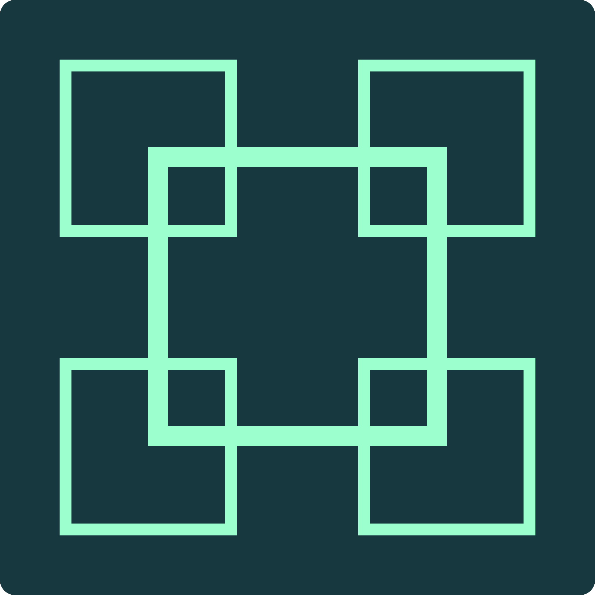
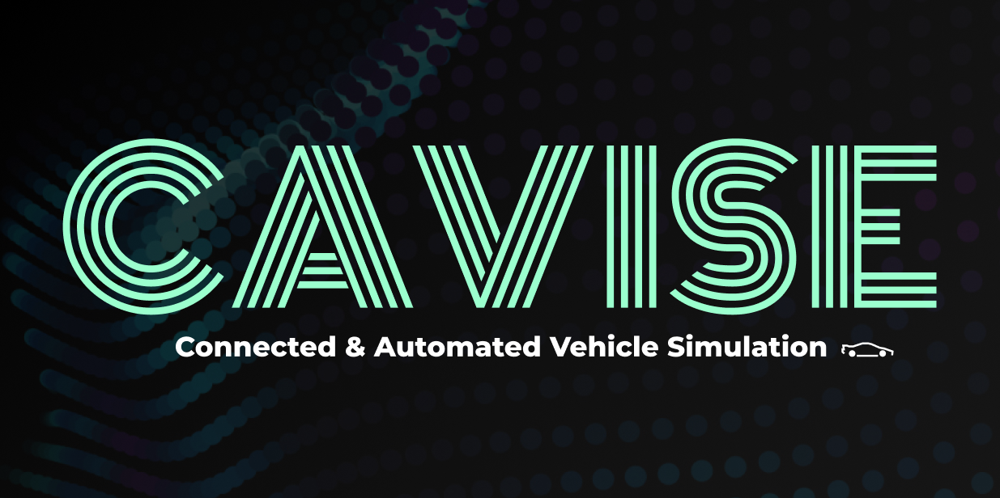
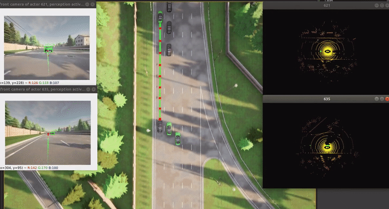
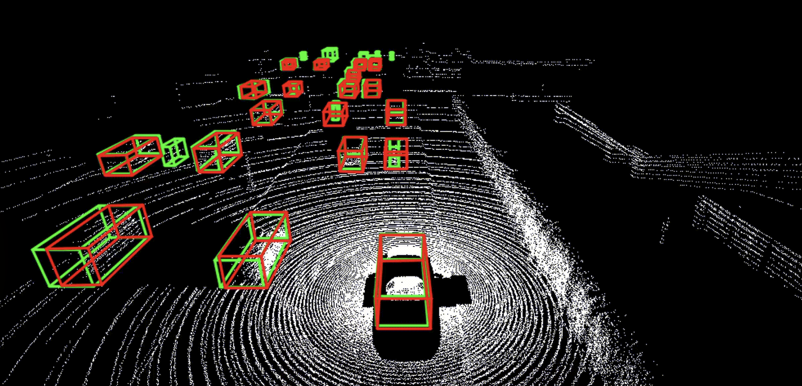
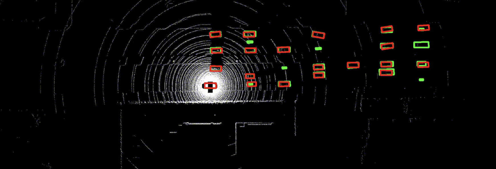

#  OpenCDA (CAVISE Fork)

<p align="center">
  
</p>

<p align="center">
  <a href="https://github.com/CAVISE/opencda/commits"></a>
  <a href="https://github.com/CAVISE/opencda/stargazers"></a>
  <a href="https://github.com/CAVISE/opencda/releases"></a>
  <a href="https://cavise.github.io/Documentation/opencda/index.html"></a>
  <a href="https://github.com/CAVISE/CAVISE"></a>
  <a href="https://github.com/CAVISE/artery"></a>
</p>

OpenCDA is a research and engineering framework for cooperative driving automation and other various applications built on top of CARLA and SUMO.

This repository is a fork of the original OpenCDA project. The upstream repository is available at [ucla-mobility/OpenCDA](https://github.com/ucla-mobility/OpenCDA).

## Overview

OpenCDA is the scenario orchestration layer of CAVISE. It turns YAML
configuration into deterministic cooperative-driving experiments and connects
the automated-driving stack to CARLA, SUMO, and Artery.

The current CAVISE fork provides:

- YAML-driven CARLA worlds with configurable maps, weather, vehicles, roadside units, background traffic, and random seeds
- localization, camera and LiDAR perception, map management, safety monitoring, planning, PID control, CARLA autopilot
- bidirectional CARLA-SUMO co-simulation and CAPI v2 communication with Artery
- reusable vehicle and RSU behavior services, including AIM client/server workflows
- OpenCOOD-based cooperative perception with visualization and evaluation metrics
- declarative attacks against behavior services and AdvCP attacks against cooperative perception pipelines
- CARLA recording, sensor data dumping, structured logging, reports, plots, and runtime metrics

See the [OpenCDA Overview and Launch](https://cavise.github.io/Documentation/opencda/index.html)
guide for the runtime workflow, launch modes, demonstrations, and links to the
detailed scenario, behavior-service, and attack documentation.

## Documentation

- [OpenCDA Overview and Launch](https://cavise.github.io/Documentation/opencda/index.html)
- [CAVISE Install & Launch](https://cavise.github.io/Documentation/wiki/install-and-launch.html)

## Requirements

For full installation and launch instructions, use the CAVISE wiki:

- [Install & Launch](https://cavise.github.io/Documentation/wiki/install-and-launch.html)

At a high level, the current fork expects:

- CARLA `0.9.16`
- Python `3.12` or higher
- CUDA and support for GPU inside Docker runtime

This fork is intended to run inside the CAVISE Docker environment. Running this fork outside Docker has not been tested.

### Native build artifacts

Protobuf modules and OpenCOOD CUDA extensions are built in independent CMake
stages. Build-only dependencies such as `protoc`, CMake, the CUDA compiler,
and Python development headers are not included in the runtime stage.

Choose the Docker target that matches the required OpenCDA features:

| Target | Protobuf | CUDA extensions | Use when |
|---|---:|---:|---|
| `opencda-minimal` | No | No | Neither Artery/CAPI nor a cooperative perception model requiring the OpenCOOD CUDA extensions is used |
| `opencda-protobuf` | Yes | No | OpenCDA communicates with Artery through CAPI |
| `opencda-cuda` | No | Yes | Cooperative perception uses a model that depends on the OpenCOOD CUDA extensions, such as FPV-RCNN |
| `opencda` | Yes | Yes | Both Artery/CAPI and CUDA-based cooperative perception are required |

Cooperative perception does not require the CUDA build by itself. For CoP
models that do not use the custom OpenCOOD CUDA extensions,
`opencda-minimal` is sufficient. Use `opencda-protobuf` instead when the same
CoP workload also communicates with Artery through CAPI. The CUDA targets are
only required by models that actually use those extensions, such as FPV-RCNN.

The full `opencda` target remains the default. With BuildKit, builder stages
that are not dependencies of the selected target are skipped completely.
Build the required image through the CAVISE `run.sh` interface:

```bash
./run.sh build opencda-minimal
./run.sh build opencda-protobuf
./run.sh build opencda-cuda
./run.sh build opencda
```

Use the same target name to start the resulting image:

```bash
./run.sh up opencda-minimal
./run.sh up opencda-protobuf
./run.sh up opencda-cuda
./run.sh up opencda
```

`run.sh` maps the selected OpenCDA build target to the Compose `opencda`
service and assigns a separate image tag to each variant. Calling `run.sh`
without an explicit OpenCDA target, or using `opencda`, selects the full image.
The same target names are accepted by every lifecycle command:
`build`, `up`, `start`, `stop`, `restart`, and `down`.

For example:

```bash
./run.sh stop opencda-protobuf
./run.sh start opencda-protobuf
./run.sh restart opencda-protobuf
./run.sh down opencda-protobuf
```

The resulting native files are stored under `/opt/opencda-artifacts`. Only the
components provided by the selected target are synchronized into the OpenCDA
source tree when the container starts. Rebuild the corresponding target after
changing a `.proto`, `.cpp`, or `.cu` source.

CUDA extensions target compute capability `8.6` by default. Override it when
building for other GPUs:

```bash
CUDA_ARCHITECTURES="75;86;89" ./run.sh build opencda-cuda
```

All four targets currently use the CUDA runtime base and install the same
Python dependencies. Selecting a target skips native compilation; it does not
produce a CPU-only image.

## Quick Start

The canonical environment setup is also documented in the CAVISE wiki:

- [Install & Launch](https://cavise.github.io/Documentation/wiki/install-and-launch.html)

Useful notes:

- Scenario configurations live in `opencda/scenario_testing/config_yaml`.
- `opencda/scenario_testing/config_yaml/default.yaml` is the shared base configuration loaded for every scenario.
- `--carla-host` defaults to `carla` in the containerized setup.
- When running OpenCDA inside the container against CARLA on Windows, use `--carla-host host.docker.internal` as documented in the CAVISE wiki.

## Usage

The main entry point is:

```bash
python3 opencda.py -t <scenario_name> [options]
```

### Core options

- `-t, --test-scenario`: Required scenario name without the `.yaml` extension. The runner loads `opencda/scenario_testing/config_yaml/<scenario>.yaml` and merges it over `default.yaml`.
- `--record`: Enable the CARLA recorder and per-actor sensor data dumping under `simulation_output/data_dumping/`.
- `-v, --version`: Show the installed OpenCDA version and exit
- `--free-spectator`: Leave the CARLA spectator camera under manual control.
- `--ticks`: Stop the scenario after the specified number of simulation ticks.
- `--verbose {1,2,3}`: Set output verbosity to minimal (`1`), informational (`2`), or full debug output (`3`, the default).
- `--log-file`: Set the structured JSON log filename. Defaults to `opencda.log.json`.

### Simulation backend

- `-x, --xodr`: Run simulation using a custom map from an XODR file.
- `-c, --cosim`: Enable co-simulation with SUMO. Requires a running SUMO container configured according to the selected scenario.
- `--carla-host`: IP address or hostname of the CARLA server (default: 'carla')
- `--carla-timeout`: Timeout of the CARLA server response in seconds (default: 30.0)

### CAPI v2 / Artery integration

CAPI v2 is the data exchange interface between OpenCDA and Artery. In this fork it is used to exchange OpenCDA and Artery data for more realistic signal propagation simulation.

- `--with-capi`: Whether to run a communication manager instance in this simulation.
- `--artery-host`: IP address or hostname and port of the Artery server (default: 'artery:7777')
- `--artery-send-timeout`: Maximum time to send a message to the Artery server, in seconds (default: 5.0).
- `--artery-receive-timeout`: Maximum time to wait for a reply from the Artery server, in seconds (default: 300.0).

### Cooperative perception

- `--with-coperception`: Whether to enable the use of cooperative perception models in this simulation.
- `--model-dir`: Path to the cooperative perception model directory.
- `--show-video-vis`: whether to show video visualization result
- `--save-vis`: whether to save visualization result
- `--save-npy`: whether to save prediction and gt result in npy_test file

Fusion behavior is resolved from the selected model configuration in `--model-dir`.

Example:

```bash
python3 opencda.py \
  -t 2cars_2rsu_coperception \
  --with-coperception \
  --model-dir opencda/coperception_models/pointpillar-late-opv2v-30 \
  --save-vis
```

### AdvCP

AdvCP-style attacks can be enabled on top of cooperative perception. `--with-advcp` requires `--with-coperception` and `--advcp-config`.

- `--with-advcp`: Enable AdvCP-style attacks for cooperative perception.
- `--advcp-config`: AdvCP attack config name or path. Relative names are resolved from `opencda/scenario_testing/config_yaml/advcp-configs`.

Example:

```bash
python3 opencda.py \
  -t 3cars_advcp_removal_check \
  --with-coperception \
  --model-dir opencda/coperception_models/pointpillar-late-opv2v-30 \
  --with-advcp \
  --advcp-config removal_forward
```

### Output directories

- `simulation_output/evaluation_outputs/`: JSON evaluation reports and generated metric plots
- `simulation_output/coperception/`: cooperative perception predictions, visualizations, and results

### Repository map

- `opencda/core`: runtime sensing, localization, planning, actuation, map, safety, application, attack, and shared manager modules
- `opencda/scenario_testing`: scenario lifecycle, YAML configurations, evaluation, and CARLA/SUMO utility APIs
- `opencda/co_simulation`: SUMO integration used by CARLA-SUMO co-simulation
- `opencda/metrics_tools`: metric collection, report generation, and plotting infrastructure
- `opencda/customize`: extension points for custom perception, localization, planning, and control algorithms
- `opencda/codriving_models`: bundled AIM/co-driving model implementations and weights
- `opencda/coperception_models`: bundled cooperative-perception model configurations and checkpoints
- `opencda/core/common/communication`: CAPI v2 transport and protobuf messages generated by the CMake builder
- `AIM`: AIM model code and assets used by cooperative-driving services
- `OpenCOOD`: bundled cooperative-perception framework
- `scripts`: map conversion, spectator control, prediction conversion, and video helper commands
- `test`: repository-level unit and integration tests

## OpenCDA Demonstration

<p align="center">
  
</p>

## Cooperative Perception Examples

### Scenario `v2xp_datadump_town06_carla`

Run cooperative perception with the bundled Where2Comm intermediate fusion model:

```bash
python3 opencda.py \
  -t v2xp_datadump_town06_carla \
  --with-coperception \
  --model-dir opencda/coperception_models/pointpillar-where2comm-intermediate-v2xsim-50 \
  --save-vis
```

<p align="center">
  
  
</p>

<p align="center"><em>Left: 3D view. Right: BEV.</em></p>

## Contributors

A huge thank you to everyone who contributes to this fork.

[](https://github.com/CAVISE/opencda/graphs/contributors)

We look forward to your contributions to help make the CAVISE OpenCDA fork even better.

See [CONTRIBUTING.md](CONTRIBUTING.md) for development setup and contribution
guidelines.

## Contact

For bug reports and feature requests related to this fork, please visit [GitHub Issues](https://github.com/CAVISE/opencda/issues). We're happy to help with OpenCDA, Artery, CAPI v2, cooperative perception, and CDA workflows.
