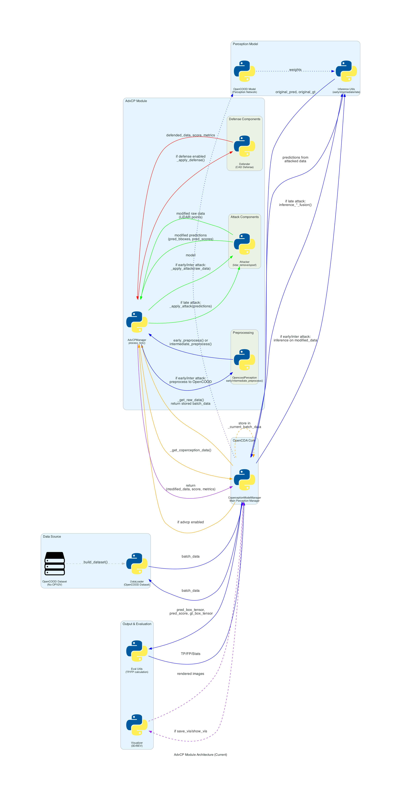
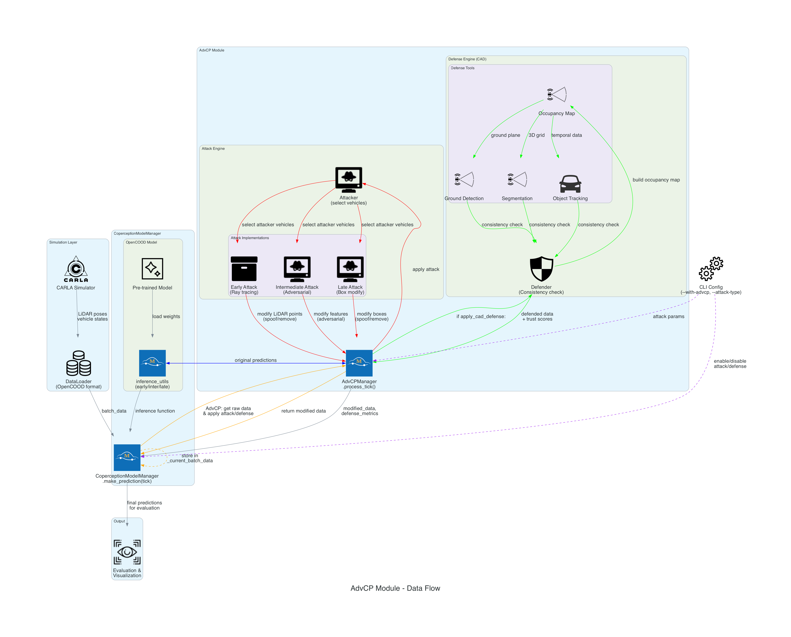

# AdvCP Module - Advanced Collaborative Perception

## Overview

The **AdvCP (Advanced Collaborative Perception)** module provides adversarial attacks and defenses for collaborative perception systems in autonomous driving. It integrates with [`CoperceptionModelManager`](../coperception_model_manager.py) to modify perception data in real-time.

## Architecture



### Key Components

- **AdvCPManager** - Main controller for attacks and defenses ([`advcp_manager.py`](advcp_manager.py))
- **OpencoodPerception** - Preprocessing component for converting raw data to OpenCOOD format ([`mvp/perception/opencood_perception.py`](mvp/perception/opencood_perception.py))
- **Attacker** - Adversarial attack components (LiDAR removal/spoofing)
- **Defender** - CAD Defense (Consistency-Aware Defense)

## Data Flow



### Main Flow

```python
CoperceptionModelManager.make_prediction(tick_number):
    for i, batch_data in enumerate(self.data_loader):
        # Store current batch data for AdvCP (avoids circular dependency)
        self._current_batch_index = i
        self._current_batch_data = batch_data

        if with_advcp:
            # 1. For late attacks: get original predictions first
            if attack_type in ["lidar_remove_late", "lidar_spoof_late"]:
                original_pred = inference_utils.inference_xxx_fusion()
                predictions = {
                    "pred_bboxes": original_pred[0],
                    "pred_scores": original_pred[1],
                    "gt_bboxes": original_pred[2]
                }
            else:
                predictions = None

            # 2. Apply AdvCP (no recursion)
            modified_data, defense_score, metrics = advcp_manager.process_tick(
                i, batch_data=batch_data, predictions=predictions
            )

            # 3. Use modified data
            if attack_type in ["lidar_remove_early", "lidar_spoof_early",
                              "lidar_remove_intermediate", "lidar_spoof_intermediate"]:
                # For early/intermediate attacks: run inference on preprocessed data
                modified_batch_data = opencood_dataset.collate_batch_test([modified_data])
                pred_box_tensor, pred_score, gt = inference_utils.inference_xxx_fusion(
                    modified_batch_data, model, opencood_dataset
                )
            else:
                # For late attacks: use modified predictions directly
                pred_box_tensor = extract_from(modified_data)
        else:
            # Normal inference
            pred_box_tensor, pred_score, gt = inference_utils.inference_xxx_fusion()
```

### Methods for Avoiding Circular Dependency

```python
# In CoperceptionModelManager
def _get_raw_data(self, tick_number: int) -> Optional[Dict]:
    """Returns raw data without running prediction"""
    # Directly access the dataset to get raw data (before preprocessing)
    # This is critical for AdvCP attacks which need raw numpy LiDAR data
    try:
        if tick_number < len(self.opencood_dataset):
            # Get raw data directly from dataset __getitem__
            # This returns data BEFORE train_utils.to_device() preprocessing
            raw_data = self.opencood_dataset[tick_number]
            return raw_data
    except Exception as e:
        logger.warning(f"Failed to get raw data for tick {tick_number}: {e}")
    return None

# In AdvCPManager
def _get_coperception_data(self, tick_number: int) -> Dict:
    """Gets data directly without calling make_prediction()"""
    raw_data = self.coperception_manager._get_raw_data(tick_number)
    if raw_data is None:
        logger.warning(f"No raw data available for tick {tick_number}")
        return {}
    return raw_data

# Updated process_tick() signature
def process_tick(self, tick_number: int, batch_data: Optional[Dict] = None,
                 predictions: Optional[Dict] = None) -> Tuple[Optional[Dict], Optional[float], Optional[Dict]]:
    """
    Process a single simulation tick with AdvCP capabilities.

    Args:
        tick_number: Current simulation tick number
        batch_data: Pre-inference batch data (for early/intermediate attacks)
        predictions: Post-inference predictions (for late attacks)

    Returns:
        Tuple of (modified_data, defense_score, defense_metrics)
    """
    # Determine attack stage and prepare data accordingly
    if self.attack_type in ["lidar_remove_late", "lidar_spoof_late"]:
        # Late attacks need both raw data and predictions
        raw_data = self._get_coperception_data(tick_number)
        if raw_data is None:
            logger.warning(f"No raw data available for tick {tick_number}")
            return None, None, None

        if predictions is None:
            logger.error("Late attacks require predictions, but none provided")
            return None, None, None

        # Apply late attack to raw data (which internally uses predictions)
        modified_predictions = self._apply_attack(raw_data, predictions, tick_number)

        # Apply defense if enabled
        if self.apply_cad_defense and self.defender:
            defended_data, defense_score, defense_metrics = self._apply_defense(
                raw_data, modified_predictions, tick_number
            )
            return defended_data, defense_score, defense_metrics

        return modified_predictions, None, None
    else:
        # Early/intermediate attacks need RAW data (not preprocessed batch_data)
        raw_data = self._get_coperception_data(tick_number)
        if raw_data is None:
            logger.warning(f"No raw data available for tick {tick_number}")
            return None, None, None

        # Apply attack to raw data
        attacked_data = self._apply_attack(raw_data, tick_number)

        # Convert attacked raw data back to OpenCOOD format using preprocessor
        if self.perception is not None:
            ego_id = self._get_ego_vehicle_id(raw_data)

            # Apply appropriate preprocessor based on attack type
            if self.attack_type in ["lidar_remove_early", "lidar_spoof_early"]:
                preprocessed_data = self.perception.early_preprocess(attacked_data, ego_id)
            elif self.attack_type in ["lidar_remove_intermediate", "lidar_spoof_intermediate"]:
                preprocessed_data = self.perception.intermediate_preprocess(attacked_data, ego_id)
            else:
                preprocessed_data = None

            if preprocessed_data is not None:
                # Apply defense if enabled
                if self.apply_cad_defense and self.defender:
                    preprocessed_data, defense_score, defense_metrics = self._apply_defense(
                        preprocessed_data, tick_number
                    )
                    return preprocessed_data, defense_score, defense_metrics

                return preprocessed_data, None, None

        return None, None, None
```

### Attack Stage Differentiation

**Early/Intermediate Attacks:**
- Work on raw point clouds before inference
- Get raw data via `_get_coperception_data()` method
- Apply attack to raw LiDAR data
- Convert attacked data back to OpenCOOD format using `OpencoodPerception`
- Run inference on preprocessed attacked data
- Examples: `lidar_remove_early`, `lidar_spoof_early`, `lidar_remove_intermediate`, `lidar_spoof_intermediate`

**Late Attacks:**
- Work on predictions after inference
- Get original predictions first via `inference_utils.inference_xxx_fusion()`
- Apply attack directly to predictions (modify `pred_bboxes`, `pred_scores`)
- No preprocessing needed
- Examples: `lidar_remove_late`, `lidar_spoof_late`

## Attack Types

| Level | Attack | Modifies | Tools |
| --- | --- | --- | --- |
| **Early** | Point removal/spoofing | Raw LiDAR points | Ray Casting Engine |
| **Intermediate** | Feature removal/spoofing | Intermediate features | Adversarial Generator |
| **Late** | Box removal/spoofing | Final bounding boxes | Direct modification |

### Attack Implementations

- [`lidar_remove_early_attacker.py`](mvp/attack/lidar_remove_early_attacker.py) - Early fusion attack - removes points via ray-tracing
- [`lidar_spoof_early_attacker.py`](mvp/attack/lidar_spoof_early_attacker.py) - Early fusion attack - injects fake object points
- [`lidar_remove_intermediate_attacker.py`](mvp/attack/lidar_remove_intermediate_attacker.py) - Intermediate fusion attack - optimizes perturbation in feature space
- [`lidar_remove_late_attacker.py`](mvp/attack/lidar_remove_late_attacker.py) - Late fusion attack - modifies bounding boxes directly
- [`adv_shape_attacker.py`](mvp/attack/adv_shape_attacker.py) - Adversarial shape attack using genetic algorithm

## CAD Defense

**Principle:** Check geometric consistency between predictions and occupancy map.

### Steps

1. **Build occupancy map:**
   - Segment LiDAR points → objects
   - Detect ground → remove
   - Track objects → temporal consistency
   - Merge data from all vehicles

2. **Check consistency:**
   - **Spoofing:** predicted box in free area → suspicious
   - **Removal:** occupied area without prediction → missed object

### Defense Components

- [`perception_defender.py`](mvp/defense/perception_defender.py) - Main CAD Defense implementation
- [`detection_util.py`](mvp/defense/detection_util.py) - Segmentation-based detection utilities
- [`sync_handler.py`](mvp/defense/sync_handler.py) - Temporal synchronization for multi-frame defense

## Configuration

### CLI Parameters

```bash
--with-advcp                    # Enable AdvCP
--attack-type <type>            # Attack type
--attackers-ratio <0.0-1.0>     # Ratio of attacking vehicles
--attack-target <strategy>      # Target selection strategy
--apply-cad-defense             # Enable CAD defense
--defense-threshold <float>     # Detection threshold
```

### Config File

[`advcp_config.yaml`](advcp_config.yaml):

```yaml
attack:
  type: "lidar_remove_early"
  ratio: 0.2
  target: "random"
  dense: 1

defense:
  enabled: true
  threshold: 0.7
```

## File Structure

```
opencda/core/common/advcp/
├── advcp_manager.py          # Main manager
├── advcp_config.py           # Config loader
├── advcp_config.yaml         # Configuration
├── architecture_diagram.py   # Architecture diagram generator
├── logic_diagram.py          # Logic diagram generator
├── architecture_diagram.png   # Architecture diagram
├── logic_diagram.png          # Logic diagram
└── mvp/                      # Implementations
    ├── attack/               # 7 attack types
    ├── defense/              # CAD defense
    ├── perception/           # OpenCOOD wrapper and preprocessing
    │   └── opencood_perception.py  # Preprocessing component
    ├── data/                 # Datasets and utilities
    ├── tools/                # Ray tracing, seg, tracking
    └── visualize/            # Visualization
```

## Tools

### Core Tools

- [`ray_tracing.py`](mvp/tools/ray_tracing.py) - Ray casting for attack primitives
- [`ground_detection.py`](mvp/tools/ground_detection.py) - Ground plane segmentation (RANSAC)
- [`lidar_seg.py`](mvp/tools/lidar_seg.py) - LiDAR segmentation for object extraction

### Analysis Tools

- [`object_tracking.py`](mvp/tools/object_tracking.py) - Multi-object tracking for temporal defense
- [`polygon_space.py`](mvp/tools/polygon_space.py) - Occupancy map generation
- [`cluster.py`](mvp/tools/cluster.py) - Point clustering (DBSCAN)

## Visualization

### What is Visualized

- **Point clouds** - LiDAR points from all vehicles
- **Ground truth bboxes** - Green 3D boxes
- **Predicted bboxes** - Red 3D boxes
- **Occupied/free areas** - Filled polygons (defense visualization)
- **Attack effects** - Spoofed object position, removed object location
- **Defense metrics** - Error areas (spoofed detections in free space, missing detections in occupied space)

### Visualization Backends

- **Matplotlib** - 2D top-down plots
- **Open3D** - Interactive 3D visualization

### Output

Visualizations saved to `simulation_output/coperception/vis_3d/` and `vis_bev/` with tick-numbered filenames.

## Summary

The **AdvCP (Advanced Collaborative Perception)** module is a comprehensive framework for **adversarial attacks and defenses** on collaborative perception systems. It:

- Integrates with OpenCOOD for model inference
- Supports early/intermediate/late fusion attacks
- Implements point removal, point spoofing, and adversarial shape attacks
- Provides CAD defense using geometric consistency checks
- Includes full visualization and evaluation tooling
- Uses `OpencoodPerception` for preprocessing raw data to OpenCOOD format
- All components are in `mvp/` submodule and are activated only when `with_advcp=True`

The attacks modify LiDAR point clouds at **sensor level** (early), **feature level** (intermediate), or **detection level** (late), while defense operates on **occupancy maps** derived from fused perceptions.

### Key Implementation Details:

- **No circular dependency**: AdvCP gets raw data via `_get_coperception_data()` without calling `make_prediction()`
- **OpencoodPerception**: Converts attacked raw data back to OpenCOOD format for early/intermediate attacks
- **Late attacks**: Work directly on predictions without preprocessing
- **Early/Intermediate attacks**: Require preprocessing before running inference
- **Defense**: Applied after attack/preprocessing, using geometric consistency checks
